# Web3 Witch — Tarot Deck

AI-сгенерированная колода карт в стиле Web3 Witch.  
Все изображения лежат в папке `cards/`.

---

## 🌙 Галерея

  <figure>
    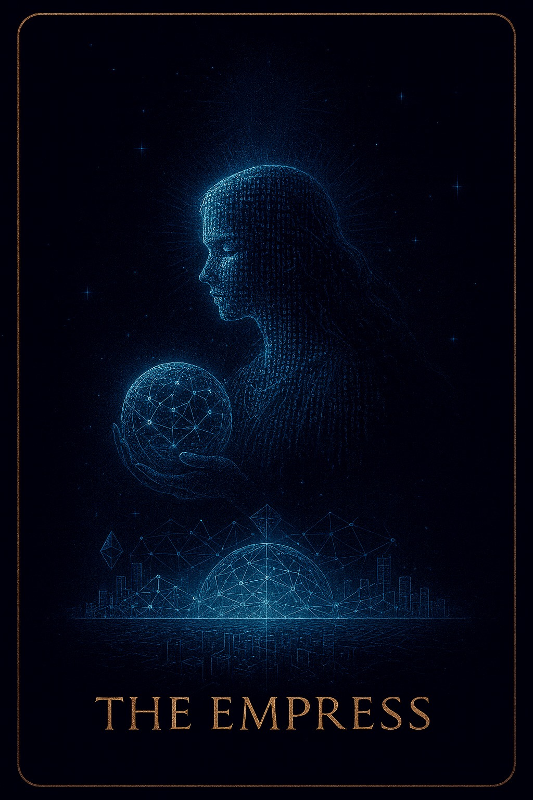<figcaption>The Empress</figcaption>
    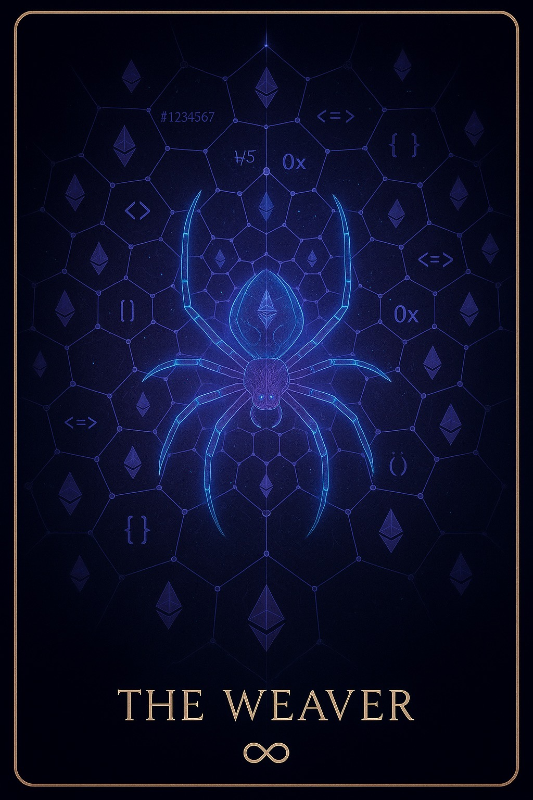<figcaption>The Initiate</figcaption>
    <figcaption>The Shadow</figcaption>
    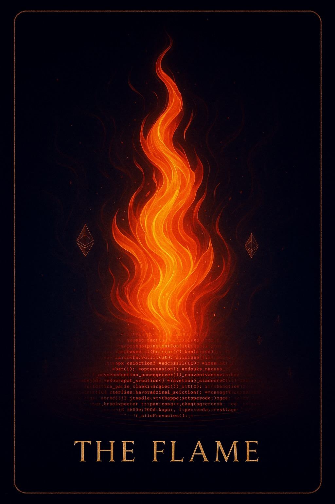<figcaption>The Flame</figcaption>
    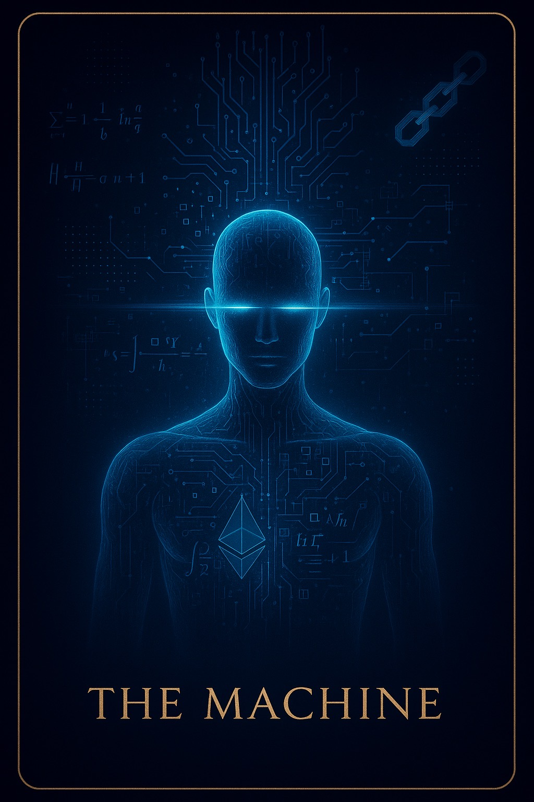<figcaption>The Machine</figcaption>
  </figure>

  <figure>
    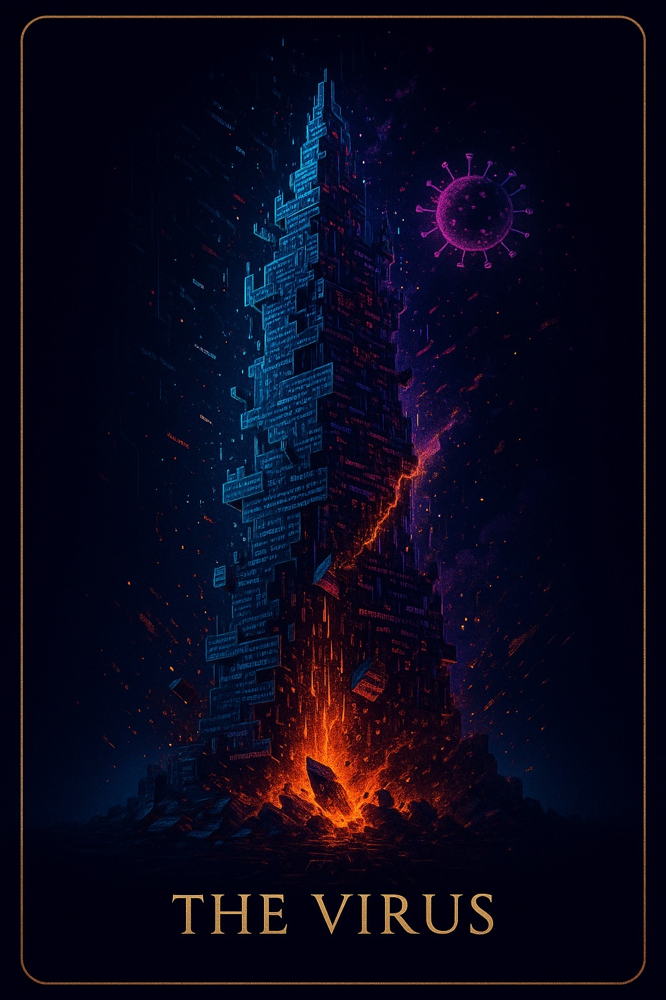<figcaption>The Virus</figcaption>
    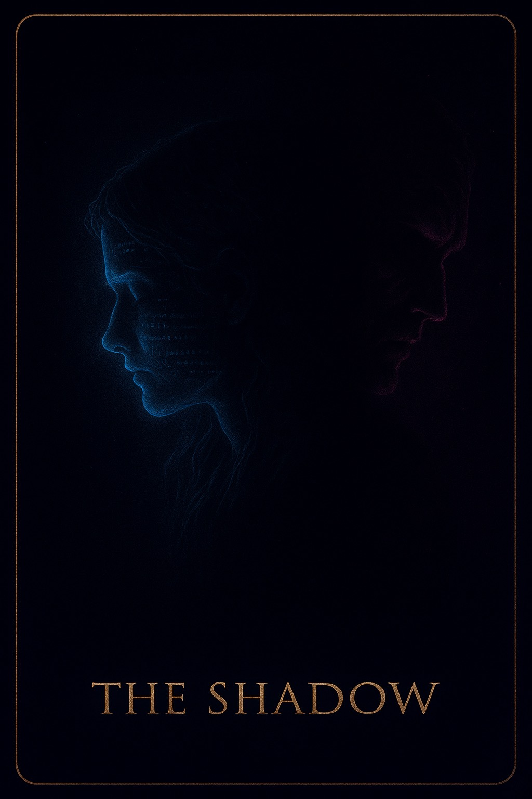<figcaption>The Child</figcaption>
    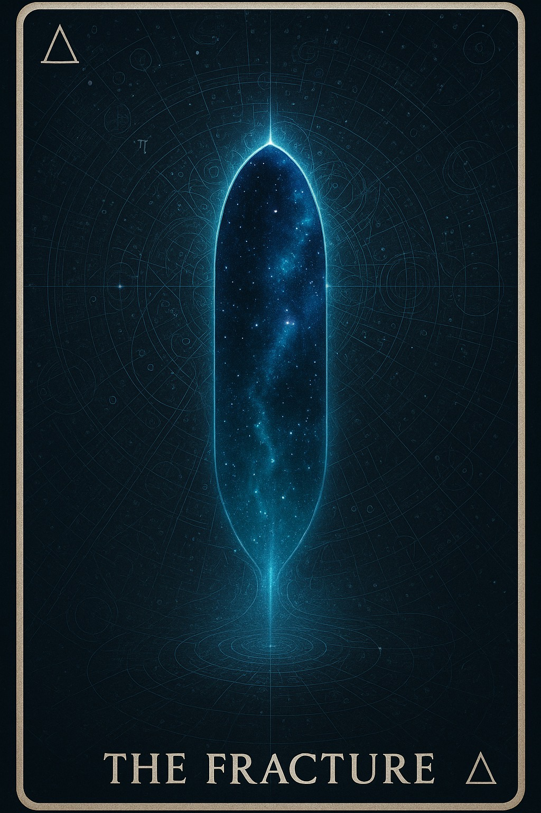<figcaption>The Fracture</figcaption>
    <figcaption>The Mirror</figcaption>
    <figcaption>The Void</figcaption>
  </figure>

  <figure>
    <figcaption>The Connection</figcaption>
    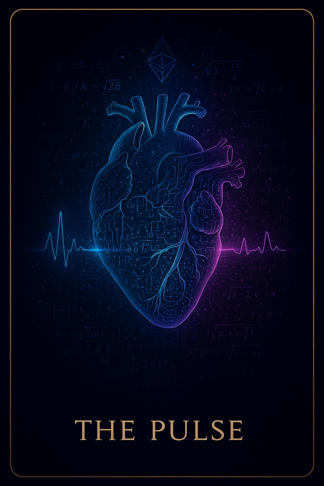<figcaption>The Gate</figcaption>
    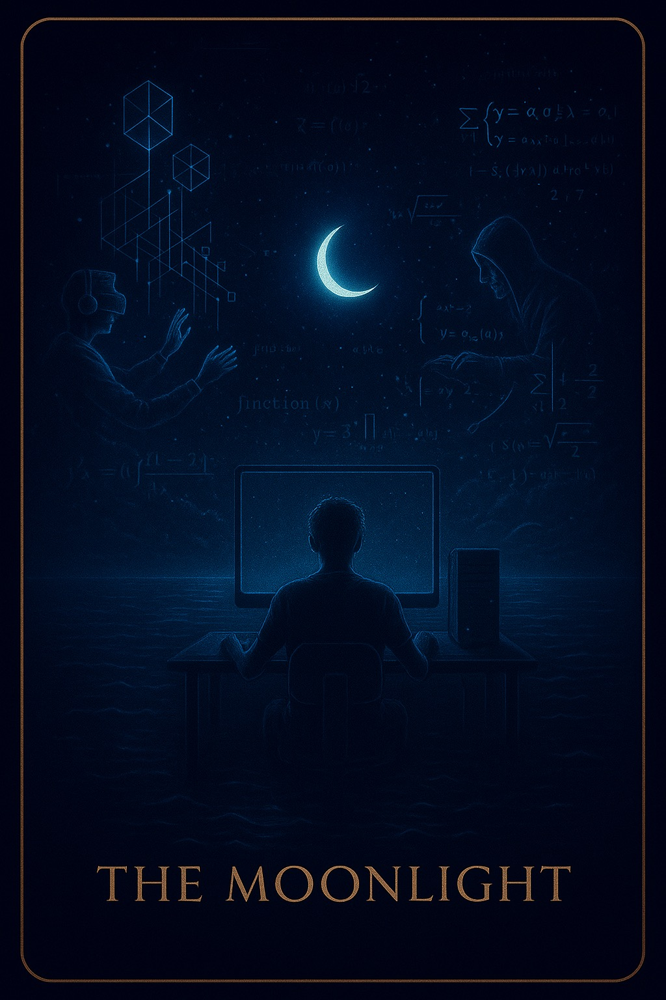<figcaption>The Moonlight</figcaption>
    <figcaption>The Weaver</figcaption>
    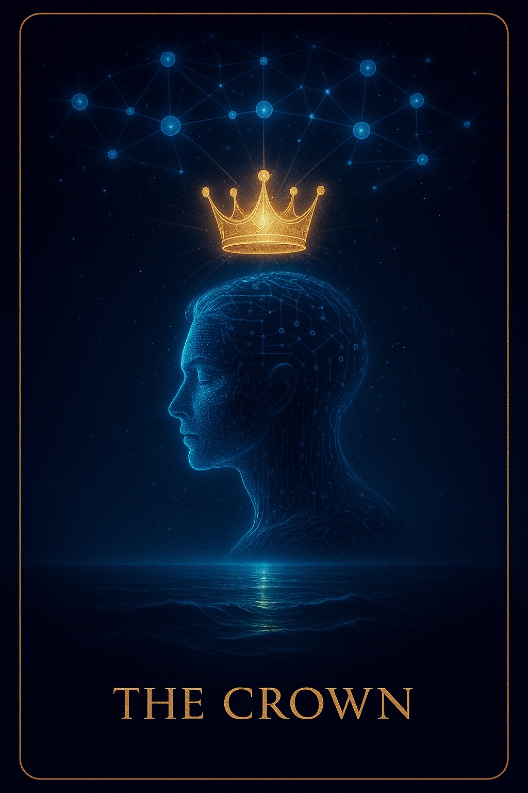<figcaption>The Crown</figcaption>
  </figure>

  <figure>
    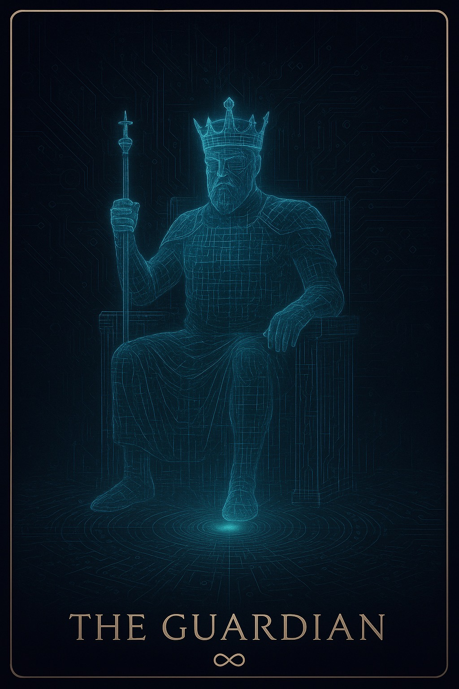<figcaption>The Guardian</figcaption>
    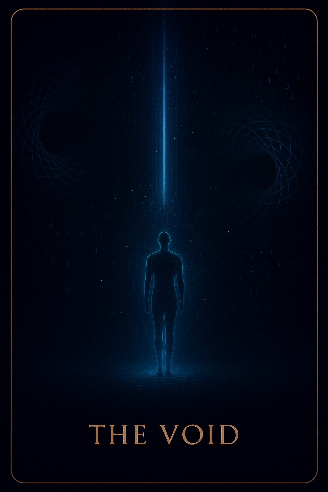<figcaption>The Oracle</figcaption>
    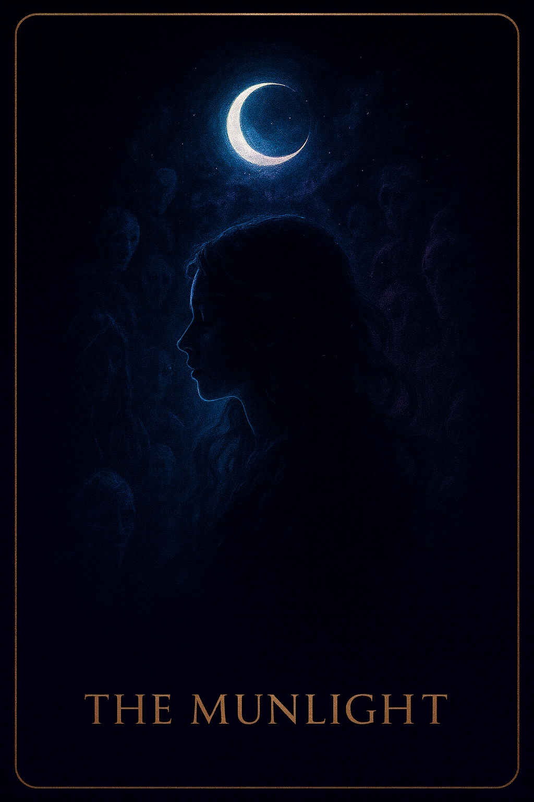<figcaption>The Dreamer</figcaption>
    <figcaption>The Hacker</figcaption>
    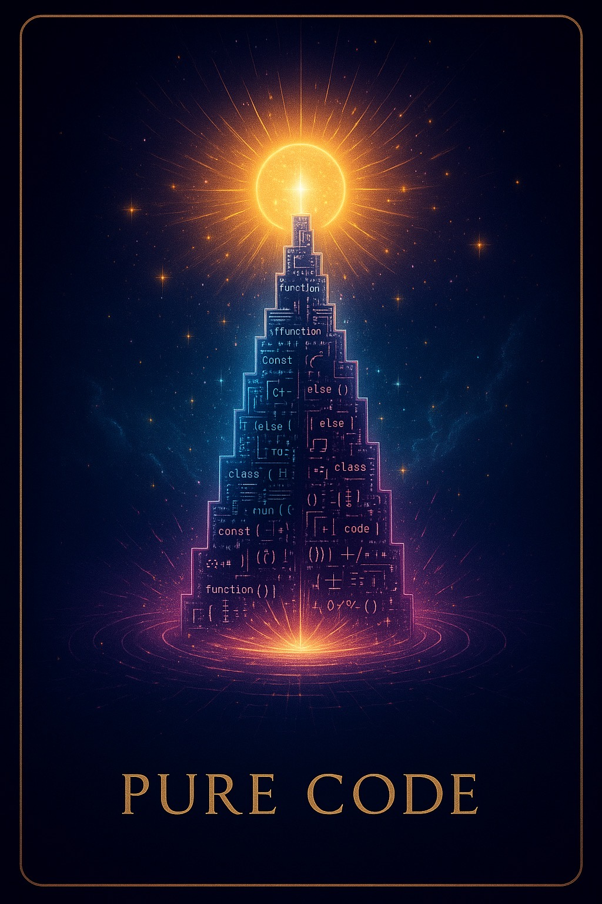<figcaption>The Pulse</figcaption>
  </figure>

  <figure>
    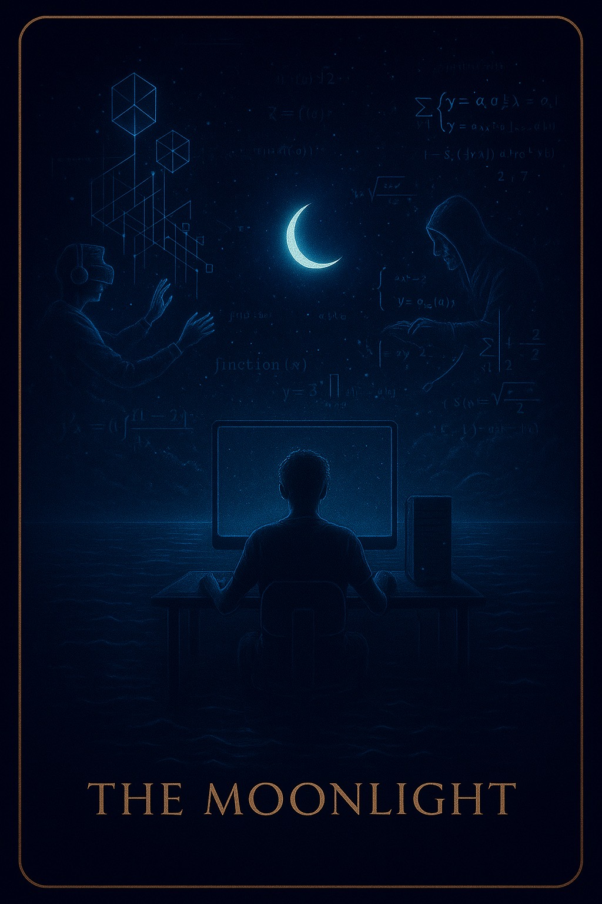<figcaption>Pure Code</figcaption>
  </figure>

